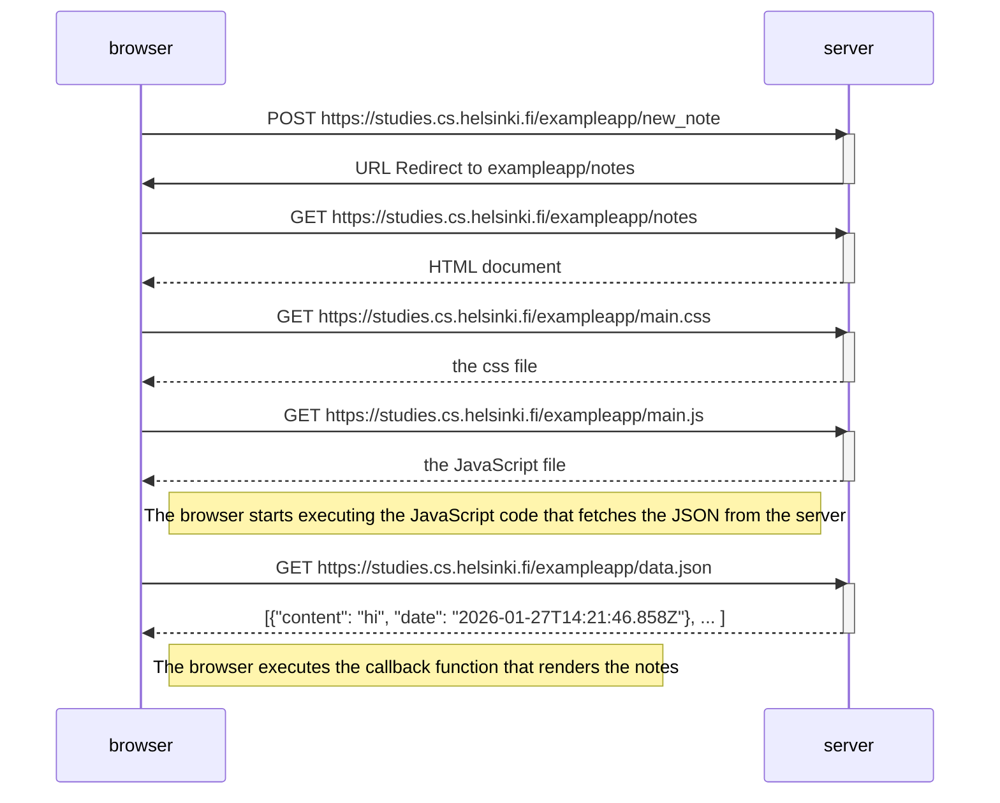

```mermaid
sequenceDiagram
	participant browser
	participant server

	browser->>server: POST https://studies.cs.helsinki.fi/exampleapp/new_note
	activate server
	server->>browser: URL Redirect to exampleapp/notes
	deactivate server

	browser->>server: GET https://studies.cs.helsinki.fi/exampleapp/notes
    activate server
    server-->>browser: HTML document
    deactivate server

    browser->>server: GET https://studies.cs.helsinki.fi/exampleapp/main.css
    activate server
    server-->>browser: the css file
    deactivate server

    browser->>server: GET https://studies.cs.helsinki.fi/exampleapp/main.js
    activate server
    server-->>browser: the JavaScript file
    deactivate server

    Note right of browser: The browser starts executing the JavaScript code that fetches the JSON from the server

	browser->>server: GET https://studies.cs.helsinki.fi/exampleapp/data.json
    activate server
    server-->>browser: [{"content": "hi", "date": "2026-01-27T14:21:46.858Z"}, ... ]
    deactivate server

    Note right of browser: The browser executes the callback function that renders the notes
```